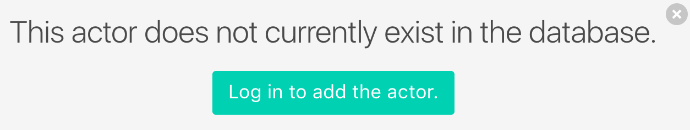
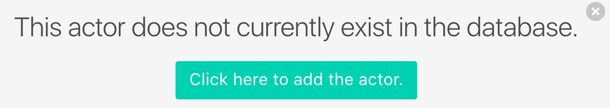
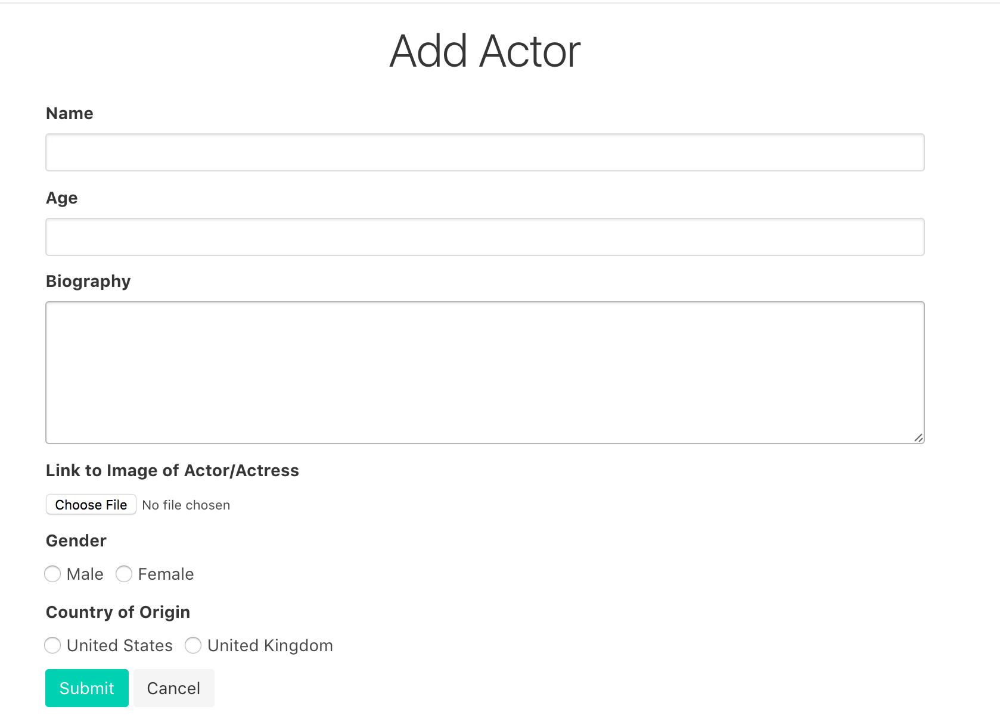

# ActorDex

Created by: Zi Pan, Christy Wong, Kelsey Ma

https://actor-dex-final.firebaseapp.com/

Libraries Used:
[Bulma](http://bulma.io/) | [Vue.JS](https://vuejs.org/) | [VueFire](https://github.com/vuejs/vuefire)
| [Firebase](https://firebase.google.com/) | [FirebaseUI](https://github.com/firebase/firebaseui-web)

## Documentation

ActorDex is an application that lets users search for actors or actresses and allow them to view their information, such as biography and filmography. Users can also add actors to their own favorites list.

### Usage

#### Search

Users are able to use the search bar to look-up actors and actresses. The search bar will attempt to autocomplete based on your search.

If the actor is not contained within the database, there will be a notification telling the user that the actor does not exist in the database. If they are logged in, it will prompt users to login and if they are logged in, it will prompt users to the add form.

#### Add/Edit Information

Users are able to add a new actor using the following form. When the form is submitted, a new entry will be created in the database with the new actor. To edit an actor's information, the form looks the same as the add actor form, with the exception of the title. When the edit form is submitted, it will update the information for the corresponding actor's entry.

#### View Actor Information

Users can view an actor or actress's information, which includes her gender, age, country of origin, biography and list of movies he or she has appeared in. From there, users can also add or remove that information (ie. adding or deleting a movie).

#### Delete Actor

From the actor profile pages, users can also delete the actor from the database.

#### Favorites

From the actor profile pages, users can also favorite actors or actresses and view a list of that from the navbar.

### Code: Architecture

#### Technologies Used
  * Vue.js - Our group decided to use the framework Vue.js because it seemed like it was the best fit for what we needed. We decided to create a Single Page Application, and Vue.js is a framework that is specifically geared towards creating SPAs. Using a framework would make the development process faster and provide the dynamic loading of new information necessary.
  * Firebase - We used Firebase for the hosting, storage, and database. In order to store the data about our users and actors, we utilized the Firebase database. However, to store the images of the actors, we use Firebase storage because it is better equipped to upload and download images. The download URL of the image is saved as the value for the "image" key for the associated actor. We also used VueFire in order to bind Vue.js templates to our Firebase data (used for the information we stored for each actor).
    * FirebaseUI - Our group used FirebaseUI for the user authentication portion of the project. We used FirebaseUI Auth in order to handle the authentication of users (correct logins and creation of new accounts) using email and Google-based login.
  * Bulma - We used the CSS framework Bulma in our project. We had originally created a basic project using Bootstrap, and liked the unified look and ease of development that a framework provided but wanted a CSS framework that had less overhead and did not require us to use jQuery. We were concerned with the amount of bloat that using Bootstrap would entail, which caused us to search for a lighter CSS framework. We settled on Bulma because it was a lightweight framework that provided a navigation bar as well (other frameworks we found did not include nav bars). Any other CSS that was required for our project was placed into a separate CSS file (main.css).

#### Code Organization

The way we organized the project was to have one page per language. On our index.html page, it contains all of our HTML code necessary. We contained all our custom JavaScript in one file (app.js), and all our custom CSS is in one file (main.css). We decided not to break the JS, CSS, and HTML into different files for each component because we wanted to maintain fast load times for our project and to minimize requests. The respective JavaScript and CSS files are contained within the JS and css folders.

### Code: Optimization & Speed Analysis

BEFORE: DOMContentLoad: 1.97s, Load: 2.30s, 24 HTTP requests

AFTER: DOMContentLoad: 1.33s, Load: 1.48s, 21 HTTP requests

We started with the the following basic optimizations:

* reduced HTTP requests combining files

* reduced filesize with minifying css and JS

* preferred CDN over firebase hosting (after individual testing, download speeds seems better - and allows for increased likelihood of cached files

Then we continued to set up the application in a SPA shell wrapper to allow a service worker to locally cache files. This substantially increased the speed due to the application not needing to repeatedly request files outside of cached ones. Using Google's Lighthouse, we also fixed many accessiblity issues while substantially increasing load speeds as well (see reports/lighthouse-unminified vs. reports/lighthouse-minfied).

### Code: Modification & Extension

For those new to the codebase, in order to begin working on the project and modifying the codebase, it would be important to understand how the code is structured. We would recomend people to first read about and understand how Vue.js components and instances work. We created Vue components associated with HTML templates for each feature, and to add a new feature to the project, people would have to create a new template then create a new Vue component, passing in the appropriate variables from the Vue instance if necessary.

### Thoughts: Concerns & Limitations

* Storage & Connections - Since we're currently just using the free version for Firebase, there is a limit to how much storage space we get for our database, which means there is a limit to how much users can add to the database. Additionally, there can only be 100 simultaneous connections, so there is a limit on number of users.

* Slow Page Loads - Our database includes a information about actors and actresses (names, photos, biographies, list of their movies). This means each person can have a lot of text and data associated with them. Also, since users are free to add actors to the database, our database may become increasingly large, especially if we upgrade to the paid versions of Firebase. Also if we upgrade, there would be an unlimited number of simultaneous connections, so there can be heavy page traffic. With so much data and/or traffic, a concern may be slower page loads (ie. waiting for an immense number of photos to load on the screen when viewing all actors).

* Usability - In the class, we didn't really consider user testing too much and we only conducted user research in the very beginning. We don't know if users would actually use our product, if the flow of the application makes complete sense, or what features or aspects of the application could be improved upon from a third party point of view.

* Security - Users, if logged in, are free to add and remove actors and movies. This can be a cause for concern since we are never 100% sure of what users will do (ie. input something harmful).

### Thoughts: Future Extension

* Favorite Actor Cards & Categories - We didn't get to implementing actor cards for a user's list of favorite actors and actresses. Currently, it is just a list, but we can improve upon this visually and create cards with images of the actors and their names. Furthermore, we could extend this further by allowing users to save their favorites in different lists/categories (such as "Favorite Action Stars").

* Notifications - When we first started the project, we had planned to have a notifications feature where users can see a feed of notifications whenever their favorite actors and actresses had any new social media updates. We didn't have time to implement this, but we think it would be a nice feature to include as an extension to our project.

* Movies - For our project, we had wanted to keep the collection of information strictly focused on the actors and actresses. We thought if we were to further include a collection of movies, our collection of data would become too large and difficult to manage. Therefore, currently, we only have a list of movies per actor, but they don't lead to their own page. However, if we were to extend our project, we can consider adding separate movie pages that includes the synopsis of the movie, a list of people who starred in it, the year it came out, etc.

* Filtering - Since we don't know how large our database of actors and actresses can become, it would be nice if we have a filtering system for the actors (ie. by gender, by what their name starts with, etc.) and allow users to more easily search for an actor.
